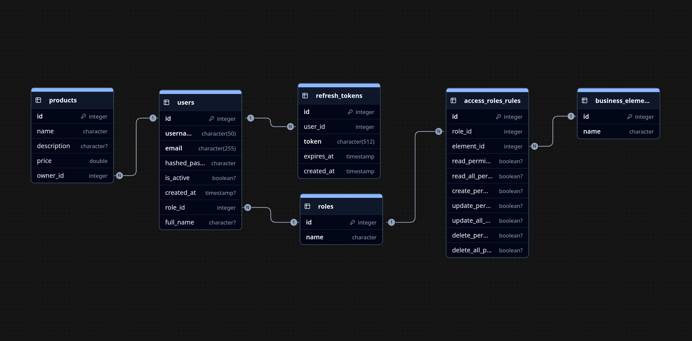

# Система аутентификации и авторизации

[](https://python.org)
[](https://fastapi.tiangolo.com)
[](https://postgresql.org)

Система управления доступом на основе ролей с использованием FastAPI и PostgreSQL.

## Содержание

- [Описание](#описание)
- [Технологии](#технологии)
- [Требования](#требования)
- [Запуск](#запуск)
- [API документация](#api-документация)
- [Тестирование](#тестирование)
- [Структура проекта](#структура-проекта)

## Описание

Система предоставляет API для управления пользователями, ролями и правами доступа к бизнес-объектам. Каждый пользователь имеет роль, которая определяет его права на определенные ресурсы.

### Основные возможности:
- Аутентификация пользователей
- Управление ролями (guest, user, admin, manager)
- Контроль доступа к бизнес-объектам
- REST API с автоматической документацией

## Технологии

- **Backend**: FastAPI 0.116.1
- **База данных**: PostgreSQL 16
- **ORM**: SQLAlchemy 2.0
- **Миграции**: Alembic
- **Аутентификация**: JWT токены
- **Контейнеризация**: Docker & Docker Compose

## Требования

- Python 3.12+
- PostgreSQL 16+
- Docker & Docker Compose (опционально)

## Запуск

### Docker (рекомендуется)

1. **Подготовка окружения**
   ```bash
   git clone https://github.com/delawer33/eff_mob_test
   cd eff_mob_test
   cp .env.example .env
   ```

2. **Запуск сервисов**
   ```bash
   docker compose up -d
   ```

3. **Создание тестовых данных**
   ```bash
   docker compose exec app python3 -m app.create_test_data
   ```

4. **Проверка работы**
   - API: http://localhost:8000
   - Swagger: http://localhost:8000/docs
   - ReDoc: http://localhost:8000/redoc

### Локальная установка

1. **Подготовка Python окружения**
   ```bash
   python3 -m venv .venv
   source .venv/bin/activate  # Linux/Mac
   # или
   .venv\Scripts\activate     # Windows
   
   pip install -r requirements.txt
   ```

2. **Настройка базы данных**
   ```bash
   # Запуск только PostgreSQL. По умолчанию внешний порт БД будет 5435, название базы test_db, пользователь и пароль postgres. Если нужно изменить эти значения, измените их в docker-compose.yaml или создайте .env файл в корне с этими параметрами
   docker compose up postgres -d
   
   # Или установка PostgreSQL локально
   # sudo apt install postgresql-16  # Ubuntu/Debian
   ```

3. **Настройка переменных окружения**
   ```bash
   cp app/config/.env.example app/config/.env
   # Отредактируйте app/config/.env файл с вашими настройками БД
   ```

4. **Создание таблиц и тестовых данных**
   ```bash
   python3 -m app.create_test_data
   ```

5. **Запуск сервера**
   ```bash
   python3 -m app.main
   ```

##  API документация

После запуска сервера доступна автоматическая документация:

- **Swagger UI**: http://localhost:8000/docs
- **ReDoc**: http://localhost:8000/redoc
- **OpenAPI JSON**: http://localhost:8000/openapi.json

## Тестирование

Тесты находятся в папке `tests/`.

### Запуск всех тестов
```bash
pytest -v

# Без предупреждений
pytest -v -W ignore
```

## Структура проекта

```
eff_mob_test/
├── app/                    # Основной код приложения
│   ├── api/               # API роутеры
│   ├── models/            # Модели базы данных
│   ├── schemas/           # Pydantic схемы
│   ├── dependencies/      # Зависимости FastAPI
│   ├── utils/             # Утилиты
│   ├── config/            # Конфигурация
│   └── db/                # Настройки базы данных
├── tests/                 # Тесты
├── docker-compose.yaml    # Docker конфигурация
└── requirements.txt       # Python зависимости
```

## Структура базы данных



### Таблицы:
- **users** - Пользователи системы
- **roles** - Роли пользователей (guest, user, admin, manager в тестовых данных)
- **business_elements** - Бизнес-объекты приложения
- **access_role_rules** - Правила доступа ролей к объектам
- **products** - Пример бизнес-объекта

### Система управления доступом

Каждый пользователь имеет роль, которая определяет его права на определенные бизнес-объекты. Права включают:
- `read` - чтение своих записей
- `read_all` - чтение всех записей
- `create` - создание
- `update` - обновление своих записей
- `update_all` - обновление всех записей
- `delete` - удаление своих записей
- `delete_all` - удаление всех записей

Назначать роли в системе имеет право только админ. Админ-пользователь имеет все права в системе. Если вы создали данные с помощью скрипта create_test_data.py, то в системе создается один админ с `email=admin@example.com`, `password=admin_password`

### Аутентификация
Аутентификация происходит с помощью JWT-токенов. После успешного логина access и refresh токены сохраняются в cookies. 

Также работает аутентификация с помощью Authirization Bearer.


